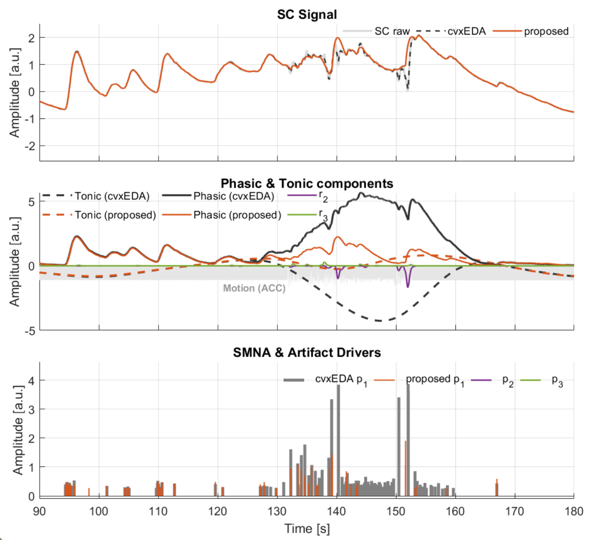

# Artifact-Aware Convex Decomposition of Electrodermal Activity

A MATLAB framework for robust decomposition of Electrodermal Activity (EDA) signals
acquired with wearable sensors, extending the established
[cvxEDA](https://doi.org/10.1109/TBME.2015.2474131) algorithm with explicit
artifact modelling and a two-stage weighted refinement procedure.

> **Paper:** G Rho, L Citi, EP Scilingo, and A Greco —
> *"Artifact Aware Convex Decomposition of Electrodermal Activity for Wearable Sensors"*,
> submitted to IEEE Journal of Biomedical Health and Informatics, 2026.

---

## Overview

<!-- INSERT OVERVIEW FIGURE HERE -->
<!-- Suggested: a multi-panel figure showing (1) a raw artifact-corrupted EDA signal,
     (2) the decomposed phasic/tonic/artifact components, and (3) a comparison
     between standard cvxEDA and this method. Save the image as docs/overview.png
     and uncomment the line below. -->
<!--  -->

EDA signals recorded with wrist-worn or hand-worn sensors are frequently
corrupted by motion artifacts caused by hand movements. Standard convex
decomposition methods treat these artifacts as residuals, which degrades the
quality of the estimated phasic and tonic components.

This framework addresses the problem in two steps:

1. **Artifact detection** — a first deconvolution pass with uniform penalty
   weights identifies candidate artifact events by thresholding the estimated
   negative and positive artifact drivers (`p2`, `p3`).
2. **Artifact-aware refinement** — if artifacts are detected, a second
   deconvolution pass is run with spatially varying penalty weights that
   locally relax the artifact driver penalties and tighten the phasic driver
   penalty around each detected artifact window.

The core optimization problem (Eq. 14 of the paper) simultaneously estimates
the phasic component, the tonic component, a linear drift term, and two
artifact components (negative and positive), all within a single convex
quadratic program solved via `quadprog`.

---

## Repository structure

```
artifact_cvxEDA/
├── artifact_cvxEDA.m          % Core convex optimization (single deconvolution pass)
├── weighted_deconv.m          % Two-stage wrapper (detection + weighted refinement)
├── scripts/
│   ├── test_on_simulated_eda_with_alpha.m   % Reproduces Section III-A of the paper
│   └── EDAart/                              % EDArt simulation framework (see below)
└── README.md
```

---

## Dependencies

- MATLAB R2019b or later
- Optimization Toolbox (`quadprog`)
- Signal Processing Toolbox (`findpeaks`, used in the test scripts)
- [EDArt](https://doi.org/10.1109/MetroXRAINE66377.2025.11340365) — the
  hand-movement artifact simulation framework, expected at
  `scripts/EDArt/` (see [EDArt reference](#references) below)

---

## Quick start

```matlab
% Load or generate your EDA signal, then normalize
y = zscore(your_eda_signal);
delta = 1/50;   % sampling interval in seconds (here: 50 Hz)

% Run the two-stage artifact-aware deconvolution with default parameters
[r, p, t, l, d, e, p2, r2, p3, r3, obj] = weighted_deconv(y, delta);

% r   : phasic component
% p   : sparse SMNA driver of the phasic component
% t   : tonic component
% p2  : sparse driver of the negative artifact component
% p3  : sparse driver of the positive artifact component
% r2  : reconstructed negative artifact component
% r3  : reconstructed positive artifact component
% e   : model residuals
% obj : value of the objective function (Eq. 14 of the paper)
```

---

## API reference

### `weighted_deconv` — two-stage wrapper

```matlab
[r, p, t, l, d, e, p2, r2, p3, r3, obj] = weighted_deconv(y, delta, ...
    alpha1, alpha2, alpha3, wl, psi1, psi2, psi3)
```

| Parameter | Default | Description |
|-----------|---------|-------------|
| `y` | — | Observed EDA signal. Normalize with `zscore` before passing. |
| `delta` | — | Sampling interval in seconds. |
| `alpha1` | `8e-4` | Penalization for the phasic SMNA driver (both stages). |
| `alpha2` | `5e-1` | Penalization for the negative artifact driver. |
| `alpha3` | `5e-1` | Penalization for the positive artifact driver. |
| `wl` | `1.3` | Duration in seconds of the penalty-modulation window following each detected artifact. |
| `psi1` | `8e-4` | Phasic driver weight inside artifact windows (second stage). |
| `psi2` | `5e-2` | Positive artifact driver weight inside artifact windows (second stage). |
| `psi3` | `5e-4` | Negative artifact driver weight inside artifact windows (second stage). |

Parameters can be left empty (`[]`) to use their default value, e.g.:

```matlab
weighted_deconv(y, delta, [], [], [], 2.0)  % only override wl
```

**Outputs**

| Variable | Description |
|----------|-------------|
| `r` | Phasic component |
| `p` | Sparse SMNA driver of the phasic component |
| `t` | Tonic component |
| `l` | Tonic spline coefficients |
| `d` | Offset and slope of the linear drift term |
| `e` | Model residuals |
| `p2` | Sparse driver of the negative artifact component |
| `r2` | Reconstructed negative artifact component |
| `p3` | Sparse driver of the positive artifact component |
| `r3` | Reconstructed positive artifact component |
| `obj` | Value of the objective function (Eq. 14 of the paper) |

---

### `artifact_cvxEDA` — core optimization

```matlab
[r, p, t, l, d, e, p2, r2, p3, r3, obj] = artifact_cvxEDA(y, delta, ...
    alpha2, alpha3, weights, tau0, tau1, delta_knot, alpha, gamma)
```

This is the single-pass solver called internally by `weighted_deconv`.
Call it directly if you want full control over the weight vectors or the
Bateman function parameters.

| Parameter | Default | Description |
|-----------|---------|-------------|
| `alpha2` | — | Penalization for the negative artifact driver (scalar or weight vector). |
| `alpha3` | — | Penalization for the positive artifact driver (scalar or weight vector). |
| `weights` | `[]` | `3 × n` matrix of point-wise penalty weights `[phasic; neg_artifact; pos_artifact]`. Pass `[]` for uniform (scalar) weighting. |
| `tau0` | `2.0` | Slow time constant of the Bateman function (seconds). |
| `tau1` | `0.7` | Fast time constant of the Bateman function (seconds). |
| `delta_knot` | `10` | Time between tonic spline knots (seconds). |
| `alpha` | `8e-4` | Penalization for the phasic SMNA driver. |
| `gamma` | `1e-2` | Penalization for the tonic spline coefficients. |

---

## Reproducing the simulated-data experiment

The script `scripts/test_on_simulated_eda_with_alpha.m` reproduces the
evaluation described in Section III-A of the paper. It requires the EDArt
toolbox to be present at `scripts/EDArt/`.

```matlab
cd scripts
% Make sure EDArt/ is present in this folder, then run:
test_on_simulated_eda_with_alpha
```


---

## References

If you use this code in published research, please cite all relevant works below.

#### Artifact-aware EDA decomposition (this method)

> G Rho, L Citi, EP Scilingo, and A Greco
> "Artifact Aware Convex Decomposition of Electrodermal Activity for Wearable Sensors"
> *Submitted to IEEE Journal of Biomedical Health and Informatics*, 2026

#### Original cvxEDA algorithm

> A Greco, G Valenza, A Lanata, EP Scilingo, and L Citi
> "cvxEDA: a Convex Optimization Approach to Electrodermal Activity Processing"
> *IEEE Transactions on Biomedical Engineering*, 2015
> DOI: [10.1109/TBME.2015.2474131](https://doi.org/10.1109/TBME.2015.2474131)

#### EDArt — artifact simulation framework

> G Rho, N Carbonaro, M Laurino, A Tognetti, and A Greco
> "EDArt: A Framework for the Simulation of Hand-Movement Artifact-Corrupted Electrodermal Activity Signal"
> *2025 IEEE International Conference on Metrology for eXtended Reality, Artificial Intelligence and Neural Engineering (MetroXRAINE)*, pp. 1325–1330, 2025
> DOI: [10.1109/MetroXRAINE66377.2025.11340365](https://doi.org/10.1109/MetroXRAINE66377.2025.11340365)

---

## License

Copyright (C) 2025–2026 Gianluca Rho, Luca Citi, Alberto Greco

This program is free software: you can redistribute it and/or modify it
under the terms of the GNU General Public License as published by the Free
Software Foundation, either version 3 of the License, or (at your option)
any later version.

This program is distributed in the hope that it will be useful, but
**without any warranty**; without even the implied warranty of
merchantability or fitness for a particular purpose. See the
[GNU General Public License](https://www.gnu.org/licenses/) for more details.

For questions or bug reports, contact: gianluca.rho@ing.unipi.it
